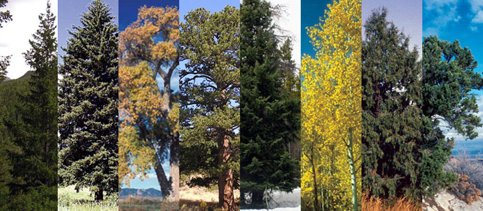

<p align="center">
    <a href="https://www.python.org/dev/peps/"></a>
</p>

<center></center>


# Project - Forest Cover Type

Read a more in detail at my [blog](https://stephanosterburg.github.io/forest/).

### Motivation

Researchers at the Department of Forest Sciences at Colorado State University collected over half a million measurements from tree observations from four areas of the Roosevelt National Forest in Colorado. All observations are cartographic variables (no remote sensing) from 30-meter x 30-meter sections of forest.

The resulting dataset includes information on tree type, shadow coverage, distance to nearby landmarks (roads etcetera), soil type, and local topography. In total there are 55 columns/features.

### Problem

Can we build a model that predicts what types of trees grow in an area based on the surrounding characteristics? Like elevation, slope, distance, soil type etcetera.

### Code Snippet


To test how accurate we can predict the `Cover_Type` I used the `KNeighborsClassifier` from sklearn, and we got an accuracy of `91.02%`. 


```python
X_train, X_test, y_train, y_test = train_test_split(X_pca, y, random_state=0)

clf = KNeighborsClassifier(weights='distance', n_jobs=-1)
clf.fit(X_train, y_train)

accuracy = cross_val_score(clf, X_train, y_train, cv = 10, scoring = 'accuracy', n_jobs=-1)
f1_score = cross_val_score(clf, X_train, y_train, cv = 10, scoring = 'f1_macro', n_jobs=-1)

# predict
predict = clf.predict(X_test)

# calculating accuracy
accuracy = accuracy_score(y_test, predict)

print('KNeighbors Classifier model')
print('Accuracy: {:.2f}%'.format(accuracy * 100))

knn_classification_report = classification_report(y_test, predict)
print(knn_classification_report)
```

### Thought(s)

We can use sklearn's `GridSearchCV` to find our features (exhaustive search over specified parameter values for an estimator). Moreover, we should make use of sklearn's `Pipeline` functionality to write clean and manageable code.

One last question, could we use clustering to make our prediction?

---

License MIT © [Stephan Osterburg](https://stephanosterburg.github.io)

