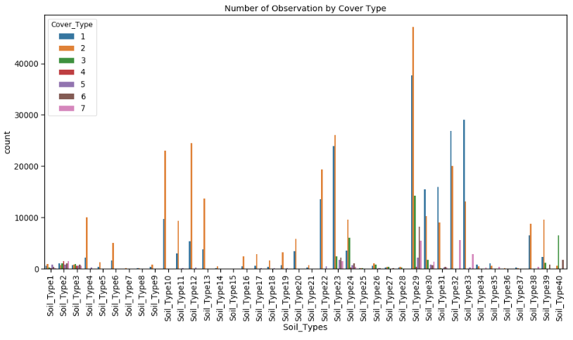
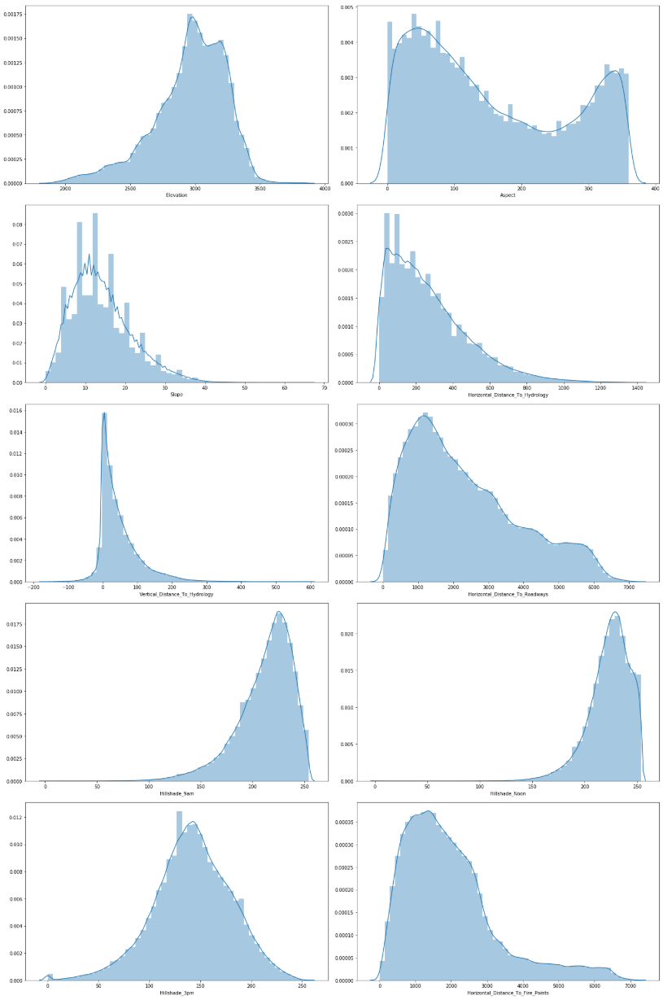
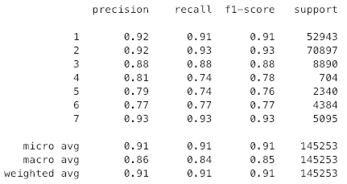

<a href="https://www.python.org/dev/peps/"></a>


# Project - Forest Cover Type

The original text can be found on my [blog](https://data-ocean.github.io/forest/)

### Introduction

Researchers at the Department of Forest Sciences at Colorado State University collected over half a million measurements from tree observations from four areas of the Roosevelt National Forest in Colorado. All observations are cartographic variables (no remote sensing) from 30-meter x 30-meter sections of forest.

The resulting dataset includes information on tree type, shadow coverage, distance to nearby landmarks (roads etcetera), soil type, and local topography. In total there are 55 columns/features.

### Problem

Can we build a model that predicts what types of trees grow in an area based on the surrounding characteristics? Like elevation, slope, distance, soil type etcetera.

### Dataset

The dataset has 55 columns in total where `Wilderness_Area` consists of 4 dummy variables and `Soil_Tpye` consists of 40 dummy variables.

Continuous Data
* `Elevation` (in meters)
* `Aspect` (in degrees azimuth[^2])
* `Slope` (in degrees)
* `Horizontal_Distance_To_Hydrology` (Horizontal distance to nearest surface water features in meters)
* `Horizontal_Distance_To_Roadways` (Horizontal distance to nearest roadway in meters)
* `Horizontal_Distance_To_Fire_Points` (Horizontal distance to nearest wildfire ignition points in meters)
* `Vertical_Distance_To_Hydrology` (Vertical distance to nearest surface water features in meters)
* `Hillshade_9am` (Hill shade index at 9am, summer solstice. Value out of 255)
* `Hillshade_Noon` (Hill shade index at noon, summer solstice. Value out of 255)
* `Hillshade_3pm` (Hill shade index at 3pm, summer solstice. Value out of 255)


[^2]: <https://en.wikipedia.org/wiki/Azimuth>


Categorical Data
* `Wilderness Area` (4 dummy variable binary columns, 0 = absence or 1 = presence)
* `Soil Type` (40 dummy variable binary columns, 0 = absence or 1 = presence)

The target variable `Cover_Type` is defined as an integer value between `1` and `7`, with the following key:

1. Spruce/Fir.       
2. Lodgepole Pine.   
3. Ponderosa Pine.   
4. Cottonwood/Willow
5. Aspen             
6. Douglas-fir       
7. Krummholz         

### Approach

#### EDA

The first step with every dataset is to do an `Exploratory Data Analysis` (EDA). What kind of data do we have? Text or numerical (continues or categorical)? Do we have missing data, or just merely wrong data — values which do not make any sense in the given context, i.e., 9999.

Because of the sheer number of soil types and wilderness areas I had a look at them first. Luckily, the researchers here were efficient in the sense that they document everything meticulously. Everything we need to know with a detailed description can be found online[^3].

[^3]: <https://archive.ics.uci.edu/ml/machine-learning-databases/covtype/covtype.info>

From that document, we can find out that
>    This study area includes four wilderness areas located in the
>    Roosevelt National Forest of northern Colorado.  These areas
>    represent forests with minimal human-caused disturbances,
>    so that existing forest cover types are more a result of
>    ecological processes rather than forest management practices.

Not that this is of any importance for our data exploration or to make a prediction, but I found it interesting to read. Because it makes you think about what kind of implications your result can potentially have.

However, what we want to find out is how the data is distributed by `Cover_Type`. Here I created a `seaborn.countplot`.

```python
tmpList = []
for c in soil_df.columns:
    tmpList += [str(c)] * soil_df[c].value_counts()[1]

se = pd.Series(tmpList)
df['Soil_Types'] = se.values

plt.figure(figsize=(16, 8))
sns.countplot(data=df, x='Soil_Types', hue='Cover_Type')
plt.title('Number of Observation by Cover Type')
plt.xticks(rotation=90)
plt.show();
```



Looking more closely at the data we can find that the top 5 soil types count for more than 50% of the measurements in the collected data.

Unlike categorical data, the continues data is even more interesting to investigate. The questions we want to find answers for are

* Do we need to scale/normalise the continuous data?
* What about skewness/kurtosis?
* Does it matter if the data is in meter, degree or index?





### Feature Selection

There are several ways to explore what features we need to keep around to make our prediction. The labour intensive workflow and the much quicker workflow - what I would like to call the "blindfolded method". For the purpose of gaining more inside, I choose to do both.

In the first workflow, I used several classifiers from the `sklearn.ensemble` Library. These are, `AdaBoostClassifier`,  `RandomForestClassifier`, `GradientBoostingClassifier` and `ExtraTreeClassifier`. All these classifiers have one thing in common, which is the attribute `feature_importances_`, which returns the feature importance (the higher the value, the more important the feature).

```python
# Create an empty dataframe to hold our findings for feature_importances_
ranking_df = pd.DataFrame()

RFC_model = RandomForestClassifier(random_state=0, n_jobs=-1)
RFC_model.fit(X, y)

importances = RFC_model.feature_importances_
indices = np.argsort(importances)[::-1]

# Get feature name
rfc_list = [X.columns[indices[f]] for f in range(X.shape[1])]
ranking_df['RFC'] = rfc_list

# Get feature importance
rfci_list = [importances[indices[f]] for f in range(X.shape[1])]
ranking_df['RFC importance'] = rfci_list
```

The result was a pandas data frame with all features from the dataset in order of importance, which allows us to pick the best features. Interestingly, `RandomForestClassifier` and `ExtraTreeClassifier` had the most similar results. Other findings from that list were,

* `Gradian Boosting` shows similar names just in a different order compared to `Random Forest` and `Extra Tree`.
* `AdaBoost` on the other hand shows an exciting and unique result. The top 8 features alone are enough to make a good class prediction. Compared to all the other classifiers, here we have `Wilderness_Area4` on above `Elevation` in the list.
* `Elevation` dominates in all classifiers with a range of `18-25%`, up to `65%` in `GBC`.
* `Hillshade` features are seen in the top 20 in 3 out of 4 classifiers. `Random Forest` and `Extra Tree Classifier` show `Hillshade` features having similar ranges.
* `Horizontal_Distance_To_Hydrology` and `Vertical_Distance_To_Hydrology` are in all classifiers in the top 10.
* `Horizontal_Distance_To_Roadways` and `Horizontal_Distance_To_Fire_Points` are represented at the top 3 out of 4 classifiers.
* `Aspect` and `Slope` also show up in the top 20 across all classifiers, with the exception of Gradian Boosting Slope which isn't in the top 20.
* In regards to `Soil_Type`, it is hard to find some commonality. Here I choose to select: `Soil_Type2`, `Soil_Type4`, `Soil_Type10`, `Soil_Type22`, `Soil_Type23` and `Soil_Type39`.

The question I asked myself at this point is, was the time wisely spend? After all, it took almost 20 minutes to calculate. One advantage this approach has is, we know our selected features.

The other approach we can choose is using `PCA` (Principal Component Analysis) from sklearn.

```python
y = df['Cover_Type']
X = df.drop('Cover_Type', axis=1)

scaler = StandardScaler()
X_scaled = scaler.fit_transform(X)

pca = PCA(n_components=20)
X_pca = pca.fit_transform(X_scaled)
```

The big advantage to this is the short processing time. However, the drawback, we are losing any knowledge regarding our features. Is that important? Possibly.

As you can see in the code snippet above, I opted to scale the features. Researching that topic, I found that there is a multitude of approaches, some use a combination of `StandardScaler`, `MinMaxScaler` and `Normalizer` method and others just picked one of the methods for scaling, centring, normalisation, binarisation and imputation the `sklearn.preprocessing` module. Some just scale only the continuous features and not the categorical, etcetera. The list of possibilities goes on. For now, I just used the most straightforward way.


### Evaluate Model


By hand selecting our features, we get an `accuracy of 92.23%` and an `f1_score of 86.74%` using cross validation. In contrast, `PCA` has an `accuracy of 90.72%` and an `f1_score of 84.44%`. Is that a big enough difference to justify the time spent to find our features? Maybe.


```python
X_train, X_test, y_train, y_test = train_test_split(X_pca, y, random_state=0)

clf = KNeighborsClassifier(weights='distance', n_jobs=-1)
clf.fit(X_train, y_train)

accuracy = cross_val_score(clf, X_train, y_train, cv = 10, scoring = 'accuracy', n_jobs=-1)
f1_score = cross_val_score(clf, X_train, y_train, cv = 10, scoring = 'f1_macro', n_jobs=-1)

# predict
predict = clf.predict(X_test)

# calculating accuracy
accuracy = accuracy_score(y_test, predict)

print('KNeighbors Classifier model')
print('Accuracy: {:.2f}%'.format(accuracy * 100))

knn_classification_report = classification_report(y_test, predict)
print(knn_classification_report)
```





To test how accurate we can predict the `Cover_Type` I used the `KNeighborsClassifier` from sklearn, and we got an accuracy of `91.02%`. That is great.


## Conclusion

**Yes**, we can build a model that predicts what types of trees grow in an area based on the surrounding characteristics.


## Final Thought

We can use sklearn's `GridSearchCV` to find our features (exhaustive search over specified parameter values for an estimator). Moreover, we should make use of sklearn's `Pipeline` functionality to write clean and manageable code.


One last question, could we use clustering to make our prediction?


---

License MIT © [Stephan Osterburg](https://stephanosterburg.github.io)

